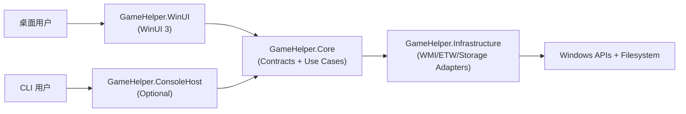

# GameHelper - 游戏助手

GameHelper 是一个面向 Windows 玩家的桌面助手，采用 WinUI 3 + .NET 8 的原生壳层，并保留 CLI 作为可选回退入口。

## 功能特性

- 进程监控：支持 ETW/WMI，自动识别游戏启动/退出
- 游玩统计：记录会话并生成总时长、近两周时长等统计
- 配置管理：支持 YAML 配置，维护游戏清单与全局设置
- Shell 分层：WinUI 与 CLI 共享 Core 用例，避免行为漂移
- 自动降级：ETW 不可用时可回退到 WMI

## 架构（WinUI-first）

依赖方向固定为：`UI/CLI -> Core -> Infrastructure`



说明：
- `GameHelper.WinUI`：主产品入口
- `GameHelper.ConsoleHost`：可选壳，便于自动化与诊断
- `GameHelper.Web`：已从仓库中删除

## 快速开始

### 环境要求

- Windows 10/11
- .NET 8 Runtime
- ETW 场景建议管理员权限

### CLI 运行示例

```powershell
# 互动模式（默认）
dotnet run --project .\GameHelper.ConsoleHost --

# 启动监控
dotnet run --project .\GameHelper.ConsoleHost -- monitor [--monitor-type ETW|WMI] [--debug]

# 查看统计
dotnet run --project .\GameHelper.ConsoleHost -- stats [--game <name>]

# 游戏配置
dotnet run --project .\GameHelper.ConsoleHost -- config list
dotnet run --project .\GameHelper.ConsoleHost -- config add <exe>
dotnet run --project .\GameHelper.ConsoleHost -- config remove <exe>
```

### WinUI 运行

在 Windows 上使用 Visual Studio 2022 打开 `GameHelper.sln`，将 `GameHelper.WinUI` 设为启动项目并运行。

## 配置文件

默认路径：`%AppData%/GameHelper/config.yml`

```yaml
processMonitorType: ETW

games:
  - name: "witcher3.exe"
    alias: "巫师3"
    isEnabled: true
    hdrEnabled: false
```

## 开发工作流（7.2）

### 非 Windows 开发者

- 重点：`GameHelper.Core`、`GameHelper.Infrastructure`、CLI 逻辑
- 可执行：核心单元测试、契约测试、纯逻辑集成测试
- 不要求：本机运行 WinUI/FlaUI

### Windows 开发者

- 覆盖：WinUI 壳层、系统集成、桌面自动化
- 负责：WinUI 手工验证、FlaUI smoke、发布链路验证

## UI 自动化策略（7.3）

- 工具：FlaUI-first
- 定位：AutomationId-first（避免文本定位脆弱性）
- 执行分层：
  - Hosted Windows：仅 deterministic smoke
  - Self-hosted interactive Windows：完整 UI 套件
- 稳定性控制：超时、重试、测试隔离、失败工件采集

## 从 Web 运行路径迁移（7.4）

原有 Web 运行路径与参数（`--web/--port`）已移除。

迁移建议：
1. 日常使用：改用 `GameHelper.WinUI`
2. 脚本/自动化：继续使用 `GameHelper.ConsoleHost`
3. 如旧脚本仍传入 `--web/--port`：请直接删除这些参数

## 依赖边界约束

- 文档：`docs/architecture/dependency-direction.md`
- 自动化校验：`GameHelper.Tests/LayerDependencyRulesTests.cs`

## 项目结构

- `GameHelper.WinUI`: WinUI 3 桌面壳（主入口）
- `GameHelper.ConsoleHost`: CLI 入口（可选回退）
- `GameHelper.Core`: 领域模型、契约、用例编排
- `GameHelper.Infrastructure`: 平台适配器与持久化
- `GameHelper.Tests`: 单元/集成/契约测试

## 许可证

本项目采用双重许可证：
- 开源使用：AGPL-3.0
- 商业使用：需商业许可证（见 `LICENSE`）
